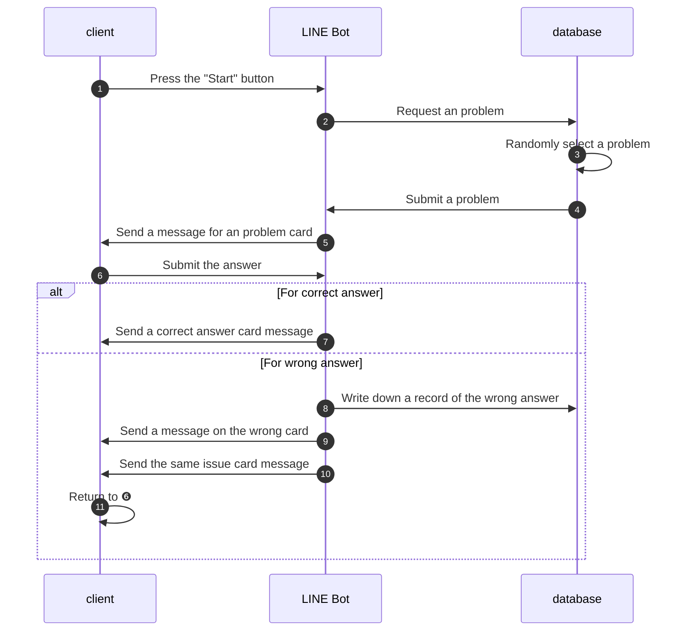
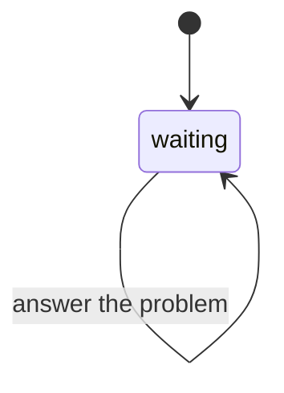
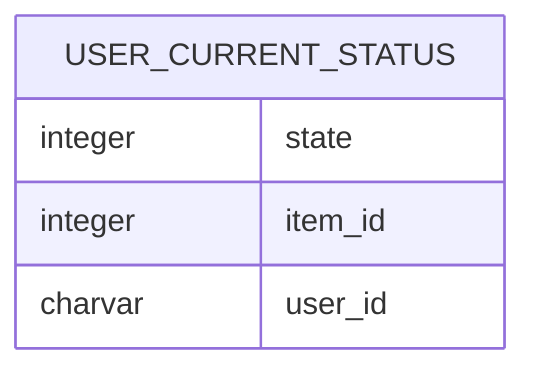

# Teihitsu Training LINE Bot

Kanji learning on the LINE platform with Kanji Teihitsu questions.

### LINE Official Account Manager

- [https://manager.line.biz/account/@664jquts](https://manager.line.biz/account/@664jquts)

### LINE Web Profile

- [https://page.line.me/664jquts](https://page.line.me/664jquts)

## Development

### Reference 

- https://github.com/line/line-bot-sdk-ruby
- [https://developers.line.biz/flex-simulator/](https://developers.line.biz/flex-simulator/)
- [https://developers.line.biz/console/](https://developers.line.biz/console/)
- [https://web.deta.sh/home/yudukikun5120/default/micros/teihitsu-api](https://web.deta.sh/home/yudukikun5120/default/micros/teihitsu-api)
- [https://devcenter.heroku.com/ja/articles/logging](https://devcenter.heroku.com/ja/articles/logging)

### Tasks

- [x]  Changed LINE account name to _Kanji Teihitsu Training (Admin Approved)_.
- [ ]  Addition of problem groups

### Sequence diagram

### State diagram

### Databases

Use Postgres 14 as the database.

